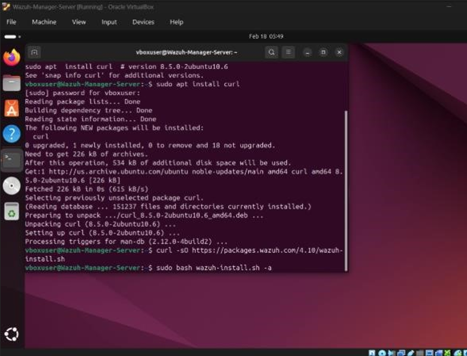
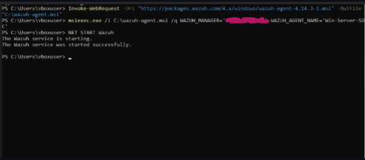
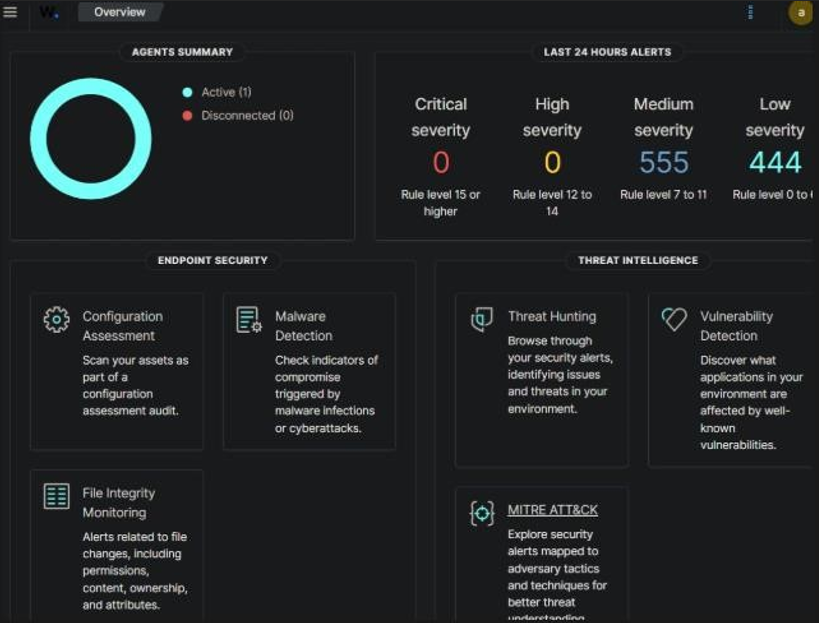
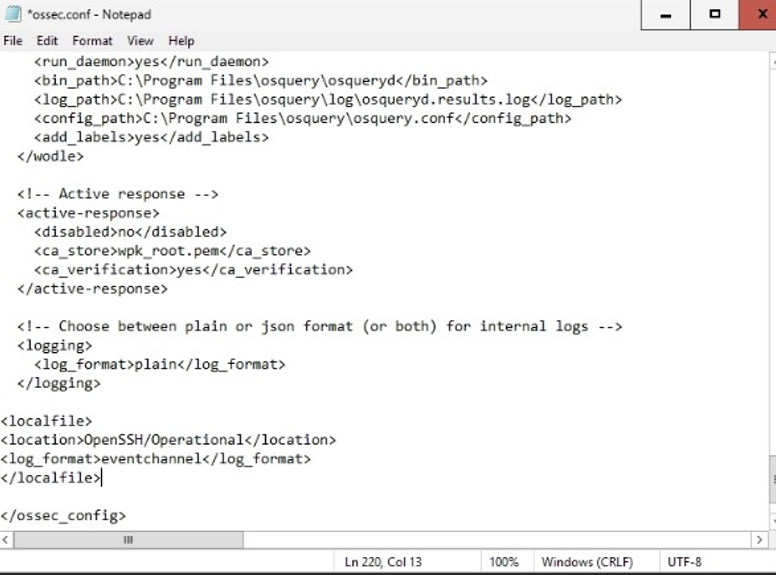
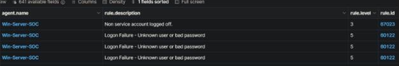
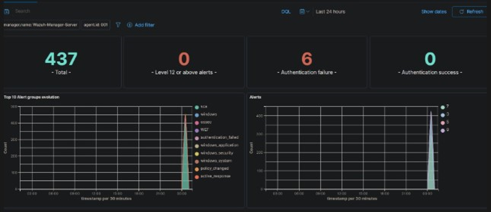
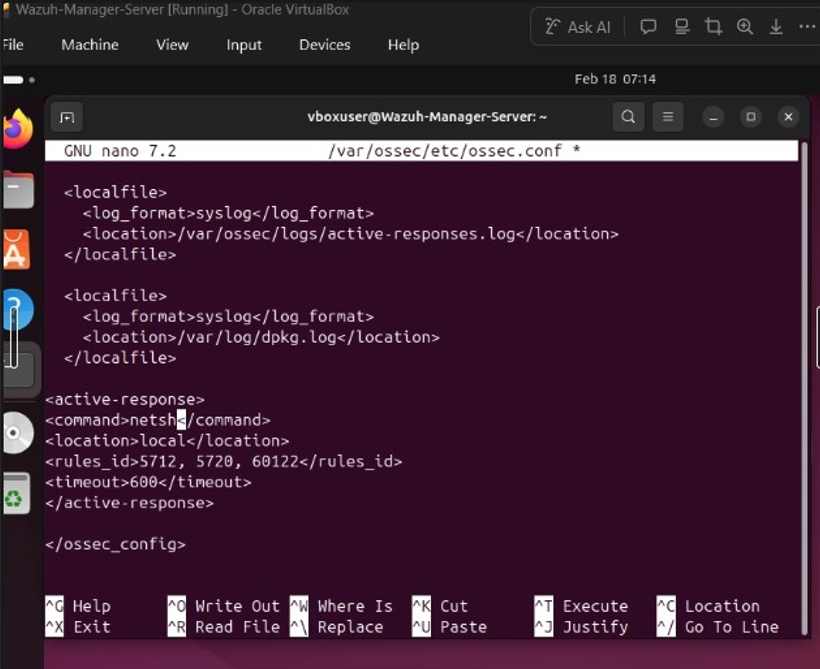
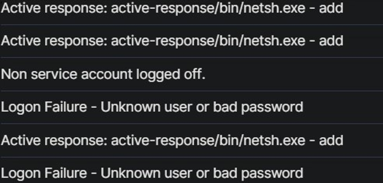

# Home Lab Report: Automated Intrusion Prevention System (IPS) 

**Engineer:** Jordan Schaefer 

**System Environment:** Ubuntu 24.04.4 (Manager), Windows Server 2025 (Agent) 
 
## Summary 

The objective of this lab was to architect and deploy a functional Security Operations Center (SOC) pipeline using Wazuh. The project successfully integrated a Windows Server endpoint into a centralized monitoring system and implemented an automated "Active Response" mechanism to mitigate SSH brute-force attacks in real-time. 
  
## Infrastructure

•	SIEM/Manager: Wazuh Manager running on Ubuntu Linux. 

•	Endpoint: Windows Server running Wazuh Agent. 

•	Network: Bridged Mode environment for realistic cross-machine communication. NAT Mode would not work for lab purposes. 

•	Protocol Monitored: Port 22 (OpenSSH for Windows). 

  
## Implementation Phases 

### Phase 0: Installation and Setup 

Started with new Virtual Machine to ensure a clean enviornment. Configured each with 3 cores, 6gb ram and 60gb storage as well as the Bridge setting in the network tab. 

Figure 1: Both ISO's Installed on Virtual Box 

Installed Wazuh Dashboard on Ubuntu machine and installed Wazuh Agent on Windows Server machine. Then proceeded with Wazuh setup process on devices. 

Figure 2: Installing and Downloading Wazuh on Ubuntu 

Figure 3: Installing and Downloading Wazuh on Windows Server 

### Phase I: Log Aggregation & Telemetry 

Configured the Windows Server agent to ship Event Channel logs to the manager. 

  
Figure 4: Wazuh Dashboard showing 1 active agent connection (Windows Server Instance) 

  
Figure 5: Custom XML Code to tell Wazuh Agent exactly where to read 

### Phase II: Attack Simulation 

First opened port 22 on the windows server machine. Then conducted a brute-force attack from the Ubuntu terminal using repeated failed SSH login attempts. 

  
Figure 6: Attack attempts from Ubuntu machine 

  
Figure 7: Attack attempts overview. 6 Authentication failures. 

  
Figure 8: The attack used (IP Blurred due to Bridge to Router) 
 
  
## Active Response Configuration 

Configured the Wazuh Manager to trigger a netsh firewall block upon detecting Rule ID 60122 (SSH Brute Force) and a few other rule ids. In figure 6 we see the log in attempts are Rule ID 60122, which is exactly what we are trying to block. 

  
Figure 9:Active Response to block the IP who attempted Rule ID 5712, 5720, 60122 for 600 seconds 
  
## Final Validation 

After applying the custom response, the attack was repeated. The Wazuh Agent successfully received the command from the manager and injected a dynamic block into the Windows Advanced Firewall. 

•	Result: Attacker IP was blocked for 600 seconds. 

•	Evidence: Verified via Wazuh in the Threat Hunter Events tab. (Figure 10) 

  
Figure 10: Active Response responding to Rule ID 60122 
  
## Conclusion 

This lab demonstrates the transition from passive monitoring to active defense and automation. By using knowledge about SIEM software and XML, I successfully implemented an automated mitigation strategy that secures the endpoint against credential stuffing attacks. 
